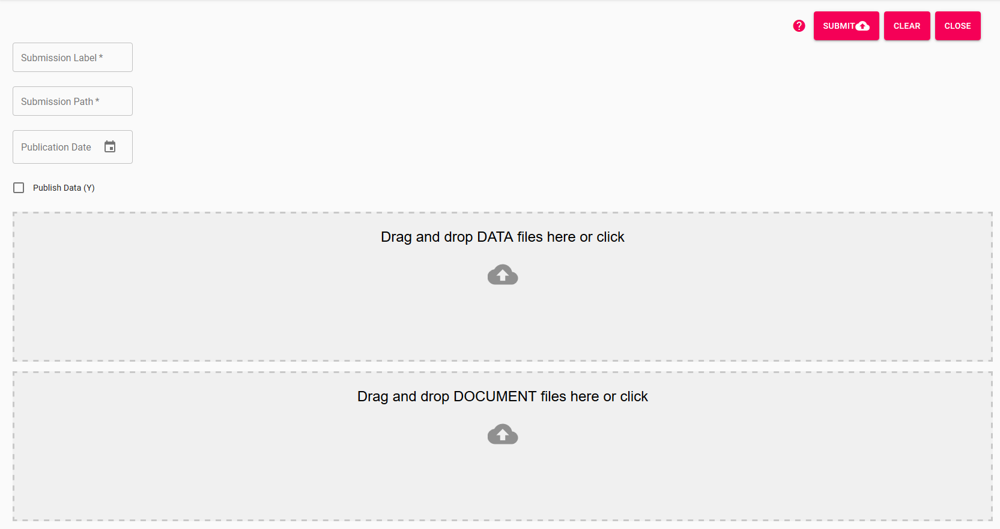
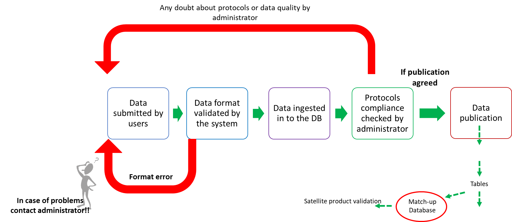

# User Manual for the OCDB Web

The aim of the Copernicus Ocean Colour Databas (OCDB) is to provide a platform to publish
ocean related _in-situ_ measurements. This tool enables researchers to upload
their own _in-situ_ data provided using the the [Seabass data format](https://earthdata.nasa.gov/esdis/eso/standards-and-references/ascii-file-format-guidelines-for-earth-science-data/seabass-data-file-format). 

The main features of the OCDB database system are rhe provision of the data to teh research
community with an enhanced search facility. Further, data that is uploaded by
teh researcher will automatically validated during the upload process which includes
a report on the validation. The researcher also keeps full control over
the submission and publication process.     

## Search

All data the submitter has agreed to publish is searchable for the public. 
The OCDB WebUI offers a search interface. Main feature of that interface is the search text field.
You can enter a single keyword which will attempt to find data using the meta
data fields provided by the submitter. This field also allows to use the
so-called Lucene syntax which enables you to search for specific field values
and also allows chaining.

__Examples__:

## Submissions

In this section we describe how to submit data. We assume that you have a user 
account and have logged in to the system. When clicking on the submission section a list of your submissions will appear including action buttons.

### New Submission

If you want to add a new submission click on New Submission on the top rihht corner.
A new dialog will open. Please add an identifier for your submission and a path
teh submissions will be stored under. This will be used to intermittantly 
store your data files and will be used when zipping data files on download.

When submitting data, you will be asked to provide a publication date. Leave this empty if you do not desire your data to be searchible. Otherwise, indicate
what date you would like your data to be available to the public.

If you don't want the data to be published, tick 'publication' allowed. This 
will be shown in the submission table to the administrators.   

Once you initiate the submission by pushing "Submit" your data will be validated
using plausibility and validation rules (link to rules).

If the validation succeeds, the status of your submission will be VALIDATED 
otherwise SUBMITTED. If the system finds errors you can view them in the 
submission file table by clicking 'list files' on the submission table item. 

### Submission Actions

__List Submission Files__:

Views a table of submissions files and enables you to apply actions (see
chapter Submission File Actions). 

__Process Data__:

Until now, the data listed in the submission is not visible in the database.
The button __Process Data__ will start the processing action. When finished,
the data will be visible, burt __ONLY__ to the submitting user and admins. 

When pushing this button, the data will be processed into the database and, 
therefore, available for searching ONLY for administrators and the submittor.

__Publish Data__:

__Publish Data__ will do exactly the same as __Process Data__, but will set
the status of the data to __PUBLISHED__ and is, therefore, visible and
downloadable by the public. The publishing process will check whether the
data has been processed already to avoid data duplication. 

__Delete Submission__:

The whole submission will be deleted including processed/published data from the search database.

 
__Halt Restart Submission__:

The user is able to halt a submission. This will denote the administrators that the
user wished that the is __NOT__ to be processed. Once the process is halted, the user 
can a __Restart__ button will appear. 

__Cancel Submission__:

Cancelling the submission will delete the database entries linked to this submission.

### Submission Statuses

From the above actions the following statuses for submissions derive.

- Submitted
- Validated
- Cancelled
- Processed
- Published

### Submission File Actions

When clicking on listing files for a submission a list of the data and document
files are listed. This new table provides the following actions:

__Delete File__:

Remove the file from the submission.

__Download File__:

Download the file if a changed to the submission file is required.

__Upload File__:

Reupload a new version of the file. The old one will be overwritten. The 
validation will be re-run.

### Submission File Statuses

- ERROR
- VALIDATED
- WARNING

